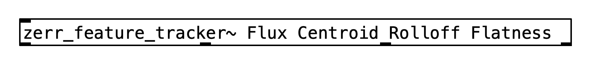
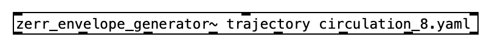
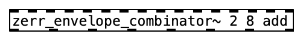
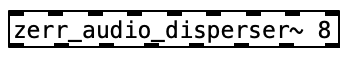

# Zerr PureData Externals

This branch contains PureData external wrappers for each Zerr module, as described in the paper ***Autogenous Spatialization for Arbitrary Loudspeaker Setups***. 

Following externals can be built from scratch. Pre-built externals can be found in the release.

- **zerr_feature_tracker~**
- **zerr_envelope_generator~**
- **zerr_envelope_combinator~**
- **zerr_audio_disperser~**

> Only *.pd_darwin for macOS in the release for now

## Structure

### configs

yaml configuration files used by zerr system. **speakers** folder contains configurations of speaker array setups. **presets** folder contains configurations for zerr system.

### dependencies

Default path of project dependencies. It contains only empty **lib** and **include** folder.

### externals

The folder to save built externals. Puredata patches for testing each externals and the combination of all externals are included.

### src

Zerr system source files, same as **src** folder in main branch

### include

Zerr system headers, same as **include** folder in main branch

### puredata

PureData external wrappers for the zerr modules. A folder corresponds to an external.

### build.sh

Script that builds all externals with one click. Tested on macOS only, not guaranteed to work on other systems. 

## How to Build

Make sure you have **Make** installed :)

### 1. Dependencies

Zerr depends on  [fftw3][http://fftw.org/] and  [yaml-cpp][https://github.com/jbeder/yaml-cpp]. Please follow the instruction from each page for installment. The default location for headers and libraries are the **lib** and **include** inside **dependencies** folder. You can copy the files there. Otherwise please edit the dependency path in Makefile.

### 2. Build separately

`cd` into to the external folder inside **puredata**. Run the **make.sh** file to start build. This script will detect and start the pd patch in builddir automaticly after building. The **PureData API (m_pd.h)** and **pd-lib-builder** are included. 

>  **zerr_envelope_generator~** external may fail to be created when pd is first started. Simply re-create (edit and save) to fix this.

### 3. Build all

You can use the **build.sh** script to build all externals together.  The built  externals can be found in the **externals** folder. The PureData patch for testing all externals will also be opened automaticly.

## Usage

### zerr_feature_tracker~

### zerr_envelope_generator~

### zerr_envelope_combinator~

### zerr_audio_disperser~

