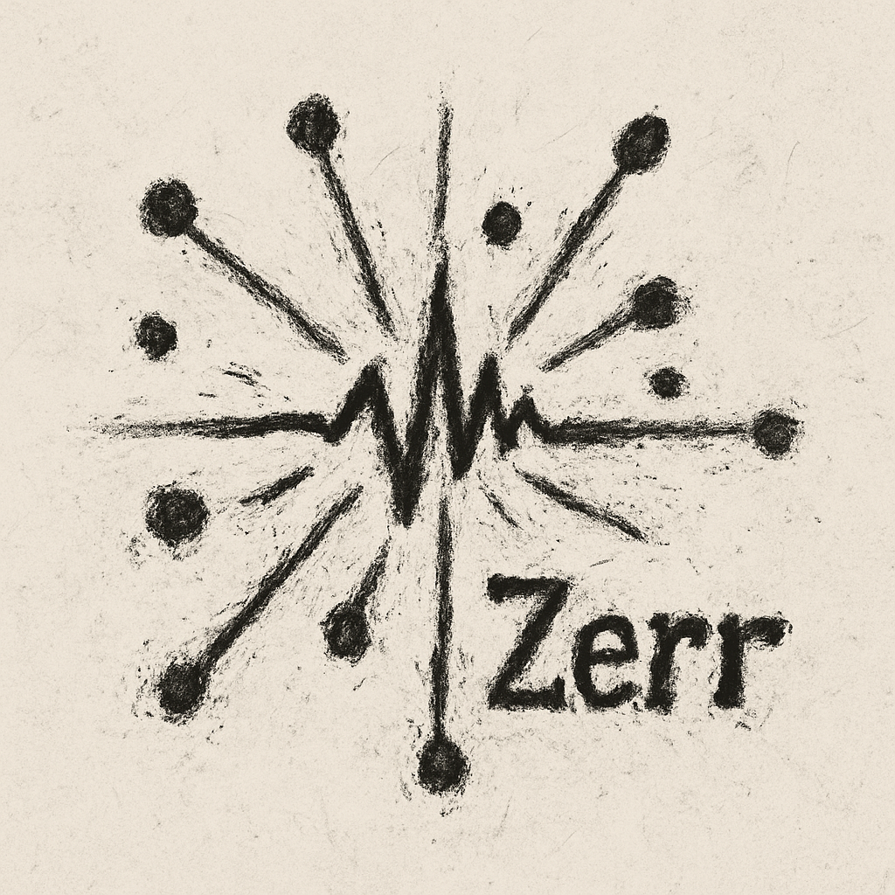

# Zerr*

## Introduction

**Zerr*** is a channel-based spatialization concept for an arbitrary audio source. It distributes audio signals to multiple loudspeakers, based only on the signals’ inherent features as well as the properties of the speaker array setup. Although various aspects of the algorithm can be tuned, also during runtime, the audio signal itself defines the spatial distribution. Depending on the parametrization, the approach can alter the original signal significantly, similar to modulation and distortion effects. Please check the [conference paper](https://ieeexplore.ieee.org/abstract/document/10289141), "Autogenous Spatialization for Arbitrary Loudspeaker Setups" for design details. 

**Zerr*** is intended to be available in various creative coding environments. The currently supported environments are listed below:

|                   | Linux | MacOS(M1) | MacOS(Intel) | Windows |
| ----------------- | ----- | --------- | ------------ | ------- |
| **Puredata**      | ✅     | ✅         | ✅            | ✅       |
| **JACK**          | 🛠️     | 🛠️         | 🛠️            | 🛠️       |
| **SuperCollider** | ⏳     | ⏳         | ⏳            | ⏳       |
| **Max/MSP**       | **➖** | ✅         | ✅            | 🛠️       |

✅: **Fully Supported**

🛠️: **In Development**

⏳: **Planned**

**➖**: **Not available**

## Installation

### Releases

You can download the precompiled version of each environment and system from Releases. Please check the readme of each environment for detail instructions.

### How to Build

Otherwise, you can also build it for your own machine. 

#### Initialization

- Clone this repo and initialize the submodules( [pd-lib-builder](https://github.com/pure-data/pd-lib-builder), [min-devkit](https://cycling74.github.io/min-devkit/) )

  ```bash
  git clone --recurse-submodules git@github.com:ringbuffer-org/Zerr.git && cd Zerr
  ```

#### Dependencies

- Zerr* uses [Conan](https://docs.conan.io/2/tutorial.html) for dependency management, please refer to its documentation for details
- The core library of Zerr* depends only on [yaml-cpp](https://github.com/jbeder/yaml-cpp) and [fftw3](https://www.fftw.org/). Both are declared once in the root `conanfile.txt` and resolved into a single shared `build/` folder that every target consumes — the core and Max/MSP via `build/conan_toolchain.cmake`, PureData via `build/conandeps.mk`

```bash
# from the repo root; pick the profile matching your host
conan install . --output-folder=build --build=missing \
  -pr:h=profiles/macos -pr:b=profiles/macos
```

- Committed profiles live in `profiles/` (`macos`, `linux`, `mingw`), so dependency resolution is reproducible instead of depending on each machine's `~/.conan2` default. Recipe revisions are pinned in `conanfile.txt` because both libraries need a ConanCenter revision that supports CMake 4. Read `profiles/macos` before changing either — it records which settings are deliberately *not* pinned, and why
- The macOS deployment target is set in `core/CMakeLists.txt` (and `maxmsp/CMakeLists.txt`), not via the Conan profile — see the comment in `profiles/macos` for the reasoning
- `./build.sh` resolves dependencies automatically on first use, so the command above is only needed for a manual or non-default build. `./build.sh deps` re-runs just the resolve step, and `./build.sh -c deps` discards it
- Conan is only required when dependencies actually need resolving; a tree with a populated `build/` folder still builds without it
- You can also edit the paths in Makefile/CMakeLists.txt to point to your own 

#### For Puredata

- Make sure you have installed [Puredata](https://puredata.info/downloads/pure-data). Building pd externals depends on the Puredata-API (m_pd.h)

- Build/Install with following commands

```bash
# build puredta externals
./build.sh puredata

# build and install puredata package
./build.sh -i puredata
```

#### On Windows

`build.sh` runs on Windows as well, from an **MSYS2 MINGW64** or Git Bash shell. It detects the host
and selects `profiles/mingw`, pins CMake to the `MinGW Makefiles` generator — without that, CMake
picks Visual Studio whenever one is installed and compiles with MSVC against a MinGW toolchain — and
uses `mingw32-make` in preference to the MSYS `make`. There is no `.bat`/PowerShell equivalent;
native `cmd.exe` is not supported.

```bash
# in an MSYS2 MINGW64 shell, with MinGW-w64 gcc 13 on PATH
./build.sh deps
./build.sh core
./build.sh puredata
```

pd-lib-builder needs to find your Pd installation for `m_pd.h`; set `PDDIR` if it does not locate it
on its own.

Max/MSP cannot be built on Windows from this script — a `.mxe64` requires an MSVC toolchain, whose
runtime and C++ ABI cannot link against the MinGW-built `libzerr_core.a` that `profiles/mingw`
produces. `./build.sh maxmsp` reports this and exits rather than failing inside Min-DevKit. See
[`docs/design/dependency-fallbacks.md`](docs/design/dependency-fallbacks.md) §3.7.

#### For Jack

```bash
# build Jack client
./build.sh jack
```


