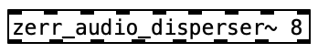

# Zerr* Puredata Externals

Zerr* can be compiled into a Puredata library. This 

PureData external wrappers for each Zerr module, as described in the paper (Autogenous Spatialization for Arbitrary Loudspeaker Setups)[https://ieeexplore.ieee.org/abstract/document/10289141]. 

Following externals can be built from scratch.

- **zerr_features~**
- **zerr_envelopes~**
- **zerr_combinator~**
- **zerr_disperser~**

## Structure

### configs

yaml configuration files used by zerr system. **speakers** folder contains configurations of speaker array setups. **presets** folder contains configurations for zerr system.

### dependencies

Default path of project dependencies. It contains only empty **lib** and **include** folder.

### externals

The folder to save built externals. Puredata patches for testing each externals and the combination of all externals are included.

### src

Zerr system source files, same as **src** folder in main branch

### include

Zerr system headers, same as **include** folder in main branch

### puredata

PureData external wrappers for the zerr modules. A folder corresponds to an external.

### build.sh

Script that builds all externals with one click. Tested on macOS only, not guaranteed to work on other systems. 

## How to Build

Make sure you have **Make** installed :)

### 1. Dependencies

Zerr depends on  [fftw3](http://fftw.org/) and  [yaml-cpp](https://github.com/jbeder/yaml-cpp). Please follow the instruction from each page for installment. The default location for headers and libraries are the **lib** and **include** inside **dependencies** folder. You can copy the files there. Otherwise please edit the dependency path in Makefile.

### 2. Build separately

`cd` into to the external folder inside **puredata**. Run the **make.sh** file to start build. This script will detect and start the pd patch in builddir automaticly after building. The **PureData API (m_pd.h)** and **pd-lib-builder** are included. 

>  **zerr_envelope_generator~** external may fail to be created when pd is first started. Simply re-create (edit and save) to fix this.

### 3. Build all

You can use the **build.sh** script to build all externals together.  The built  externals can be found in the **externals** folder. The PureData patch for testing all externals will also be opened automaticly.

## Usage

### zerr_features~

**zerr_feature_tracker~** external calculates different audio features from one mono audio input. Use the feature names in the pd object arguments to indicate the features to be extracted. The outlets send the extracted audio features in the audio rate and in the same order of the feature names in arguments.

**Valid feature name:**

- RootMeanSquare
- ZeroCrossingRate
- Flux
- Centroid
- Rolloff
- CrestFactor
- Flatness
- ZeroCrossings
- ...

### zerr_envelopes~

**zerr_envelope_generator~** creates envelope according to the income control signal and the speaker configuration. The first argument assign the envelope generation mode (trajectory/trigger). The second argument is the path to the speaker array configuration file. Relative path is supported.

### zerr_combinator~

**zerr_envelope_combinator~** combines the multi-channel envelopes from different generators. The first argument is the number of generator and the second is the channel number of every generator. It means that only generators with same channel number can be added together.  Inlet number equals to source number x channel number and the inlets are grouped by source. e.g in the demo graph there are 16 inlets. The first 8 inlets are the 1-8 channels of the first input source. Inlet 9-16 is the second.

### zerr_disperser~

**zerr_audio_disperser~** distributes the mono source audio to multi-channels by multiply it with multi-channel envelope. The only argument indicates the channel number. The first inlet receives the input of mono source audio with the rest receives the envelopes.

